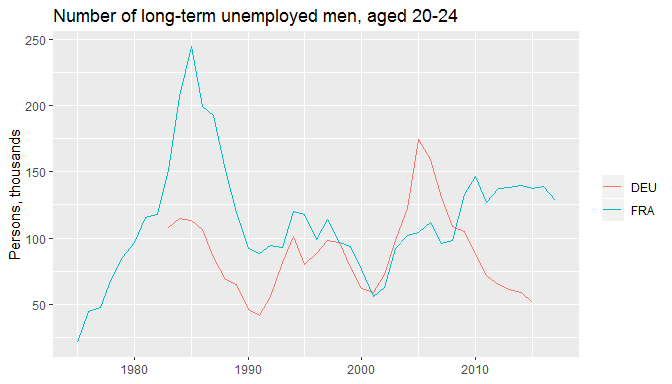
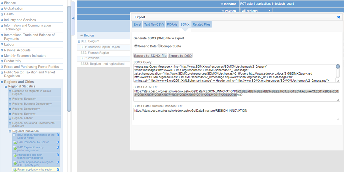

[](https://travis-ci.org/expersso/OECD)
[](http://cran.r-project.org/web/packages/OECD)
[](http://cran.r-project.org/web/packages/OECD)

http://cranlogs.r-pkg.org/badges/grand-total/OECD


### Introduction

The `OECD` package allows the user to download data from the OECD's API in a
dynamic and reproducible way.

The package can be installed from either CRAN or Github (development version):


```r
# from CRAN
install.packages("OECD")

# from Github
library(devtools)
install_github("expersso/OECD")

library(OECD)
```

### How to use the package

Unless you know the exact code of the series you're looking for, the best way to
start is by downloading a dataframe with all the available datasets and their 
descriptions, and then run searches on it. The search string can be a regular
expression and is case-insensitive by default.


```r
dataset_list <- get_datasets()
search_dataset("unemployment", data = dataset_list)
```

```r
id                title
AVD_DUR           Average duration of unemployment
AEO2012_CH6_FIG19 Figure 19: The trade off between vulnerable employment...
AEO2012_CH6_FIG29 Figure 29: Youth employment and unemployment by education...
AEO2012_CH6_FIG4  Figure 4: Youth and adult unemployment
DUR_I             Incidence of unemployment by duration
DUR_D             Unemployment by duration
```

In the following we'll explore the `DUR_D` data set, which contains data on 
the duration of unemployment.


```r
dataset <- "DUR_D"
```

Before downloading the series we are interested in, it is often prudent to look 
at the data structure, to see what type of breakdowns the data set offers:


```r
dstruc <- get_data_structure(dataset)
str(dstruc, max.level = 1)
```

```
## List of 12
##  $ VAR_DESC       :'data.frame':	12 obs. of  2 variables:
##  $ COUNTRY        :'data.frame':	53 obs. of  2 variables:
##  $ TIME           :'data.frame':	47 obs. of  2 variables:
##  $ SEX            :'data.frame':	3 obs. of  2 variables:
##  $ AGE            :'data.frame':	6 obs. of  2 variables:
##  $ DURATION       :'data.frame':	8 obs. of  2 variables:
##  $ FREQUENCY      :'data.frame':	1 obs. of  2 variables:
##  $ OBS_STATUS     :'data.frame':	14 obs. of  2 variables:
##  $ UNIT           :'data.frame':	295 obs. of  2 variables:
##  $ POWERCODE      :'data.frame':	32 obs. of  2 variables:
##  $ REFERENCEPERIOD:'data.frame':	56 obs. of  2 variables:
##  $ TIME_FORMAT    :'data.frame':	5 obs. of  2 variables:
```

The `get_data_structure` function returns a list of dataframes with
human-readable values for variable names and values. The first data frame
contains the variable names and shows the dimensions of a dataset:


```r
dstruc$VAR_DESC
```

```
##                 id        description
## 1          COUNTRY            Country
## 2             TIME               Time
## 3              SEX                Sex
## 4              AGE                Age
## 5         DURATION           Duration
## 6        FREQUENCY          Frequency
## 7        OBS_VALUE  Observation Value
## 8      TIME_FORMAT        Time Format
## 9       OBS_STATUS Observation Status
## 10            UNIT               Unit
## 11       POWERCODE    Unit multiplier
## 12 REFERENCEPERIOD   Reference Period
```

It is often easiest not to specify any filters at this point, but rather
download the entire dataset and then filter it with native `R` functions.
However, sometimes the dataset is very large, so filtering it before download
will cut down on download time. To illustrate, let's find out the available
filters for the variables `SEX` and `AGE`:


```r
dstruc$SEX
```

```
##      id       label
## 1    MW All persons
## 2   MEN         Men
## 3 WOMEN       Women
```

```r
dstruc$AGE
```

```
##       id    label
## 1   1519 15 to 19
## 2   1524 15 to 24
## 3   2024 20 to 24
## 4   2554 25 to 54
## 5   5599      55+
## 6 900000    Total
```

Let's say we're only interested in the duration of unemployment of men aged 20
to 24 in Germany and France. We provide these filters in the form of a list to 
the `filter` argument of the `get_dataset` function:


```r
filter_list <- list(c("DEU", "FRA"), "MW", "2024")
df <- get_dataset(dataset = dataset, filter = filter_list)
head(df)
```

```
##   COUNTRY SEX  AGE DURATION FREQUENCY attrs.df obsTime obsValue
## 1     DEU  MW 2024       UN         A      P1Y    1983    321.2
## 2     DEU  MW 2024       UN         A      P1Y    1984    332.9
## 3     DEU  MW 2024       UN         A      P1Y    1985    333.9
## 4     DEU  MW 2024       UN         A      P1Y    1986    311.7
## 5     DEU  MW 2024       UN         A      P1Y    1987    291.2
## 6     DEU  MW 2024       UN         A      P1Y    1988    264.8
```

Let's say we're only interested in long-term unemployment. We can then first
look at the variable `DURATION` to find the different levels, then go back to
our list of variable descriptions to learn what they mean:


```r
unique(df$DURATION)
```

```
## [1] "UN"  "UN1" "UN2" "UN3" "UN4" "UN5" "UND" "UNK"
```

```r
dstruc$DURATION
```

```
##    id                    label
## 1 UN1                < 1 month
## 2 UN2 > 1 month and < 3 months
## 3 UN3 > 3 month and < 6 months
## 4 UN4   > 6 month and < 1 year
## 5 UN5          1 year and over
## 6  UN                    Total
## 7 UND           Total Declared
## 8 UNK                  Unknown
```

We could of course merge the two data structures, but working with the mnemonic
labels usually saves you quite a bit of typing in the long run.

### Plotting the results

We can now subset to only those unemployed for a year or more, and finally
produce a plot.


```r
df_plot <- df[df$DURATION == "UN5", ]
df_plot$obsTime <- as.numeric(df_plot$obsTime)

library(ggplot2)

qplot(data = df_plot, x = obsTime, y = obsValue, color = COUNTRY, geom = "line") +
  labs(x = NULL, y = "Persons, thousands", color = NULL,
       title = "Number of long-term unemployed men, aged 20-24")
```

 

If we want more in-depth information about a dataset (e.g. methodology, exact
definitions of variables, etc), `browse_metadata` opens up a web
browser with the metadata for the requested series.


```r
browse_metadata(dataset)
```

### Alternative data-acquisition strategy

If one does not know exactly what data one is looking for, or if a data set 
contains e.g. a large number of breakdowns, it is often easier to first explore 
the data on the [OECD stats website](http://stats.oecd.org) and then use the
`oecd` package to make the data acquisition programmatic and reproducible. The
workflow would then be as follows:

1. Find the data set and apply relevant filters on the OECD website.
1. Select "Export -> SDMX (XML)"
1. Copy the generated filter expression (which follows directly after the data set name, 
see screenshot below).
1. Insert this expression as the value to the `filter` argument of the `get_dataset` 
function and set the `pre_formatted` argument to `TRUE`.


```r
df <- get_dataset("PATS_REGION",
                  filter = "PCT_A.INVENTORS.BEL+BE10.TOTAL+BIOTECH", 
                  pre_formatted = TRUE)
head(df)
```

```
##   KINDPATENT KINDREGION REGIONS  TECHNO TIME_FORMAT UNIT POWERCODE obsTime
## 1      PCT_A  INVENTORS    BE10 BIOTECH         P1Y  NBR         0    1977
## 2      PCT_A  INVENTORS    BE10 BIOTECH         P1Y  NBR         0    1978
## 3      PCT_A  INVENTORS    BE10 BIOTECH         P1Y  NBR         0    1979
## 4      PCT_A  INVENTORS    BE10 BIOTECH         P1Y  NBR         0    1980
## 5      PCT_A  INVENTORS    BE10 BIOTECH         P1Y  NBR         0    1981
## 6      PCT_A  INVENTORS    BE10 BIOTECH         P1Y  NBR         0    1982
##   obsValue
## 1        0
## 2        0
## 3        0
## 4        0
## 5        0
## 6        1
```



### Other information

The OECD API is currently a beta version and ["and in preparation for the full
release, the structure and content of datasets are being reviewed and are likely
to evolve"](http://stats.oecd.org/OpenDataAPI/index.htm). As a result, the
`OECD` package may break from time to time, as I update it to incorporate 
changes to the API. If you notice a bug (or if you have suggestions for 
improvements), please don't hesitate to contact me or send a pull request.

This package is in no way officially related to or endorsed by the OECD.
